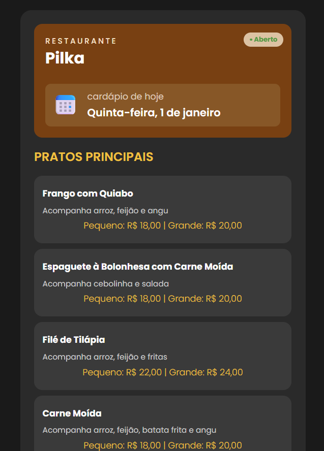
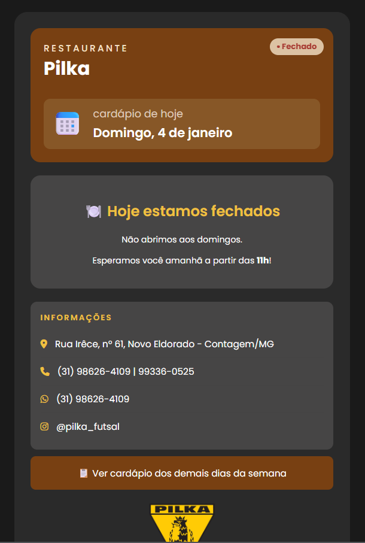
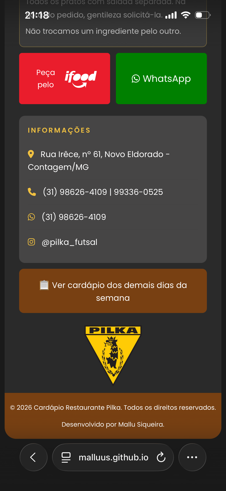
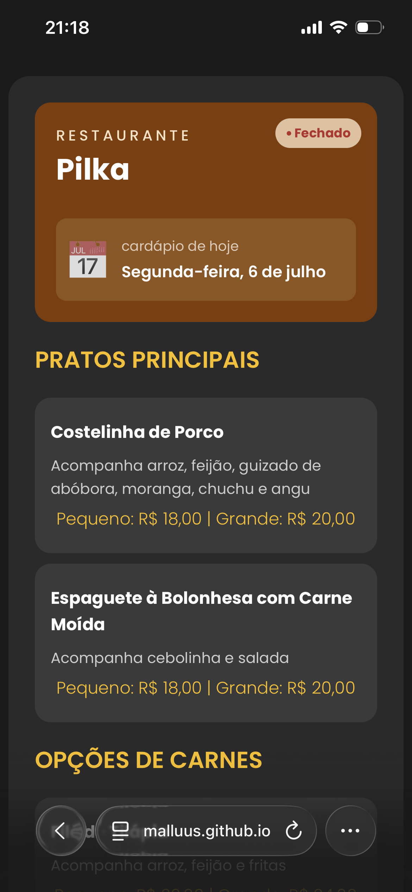

# 🍽️ Cardápio Online - Restaurante Pilka

Cardápio digital desenvolvido para o Restaurante Pilka, localizado em Contagem/MG.

## 📋 Sobre o Projeto

Site desenvolvido para exibir o cardápio diário do restaurante de forma dinâmica e responsiva. O cardápio é atualizado automaticamente de acordo com o dia da semana, facilitando o acesso dos clientes às opções disponíveis.

## ✨ Funcionalidades

- Exibição automática do cardápio do dia atual
- Status de aberto/fechado em tempo real
- Data atualizada dinamicamente
- Links diretos para pedido via iFood e WhatsApp
- Acesso ao cardápio completo da semana via Google Drive
- Links clicáveis para localização, WhatsApp e Instagram
- Layout responsivo para dispositivos móveis

## 🛠️ Tecnologias Utilizadas

- HTML5
- CSS3
- JavaScript (Vanilla)
- Font Awesome (ícones)
- Google Fonts (Poppins)

## 👩‍💻 Desenvolvedora

Mallu Siqueira — estudante de Sistemas de Informação no IFMG Sabará

## 📸 Screenshots

### Cardápio do dia

### Versão domingo (restaurante fechado)

### Versão mobile

### Status fechado no mobile

